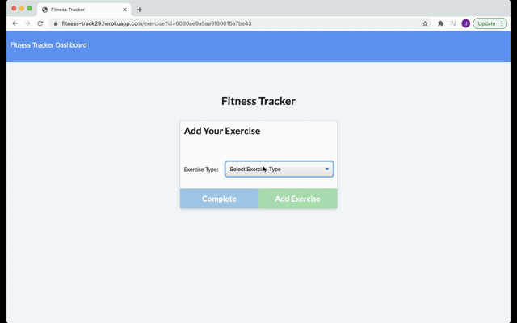

# fitness-track

 

## Table of Contents
* [Title](#title)
* [Deployed Link](#deployed-link)
* [Site Picture](#site-gif)
* [Technologies Used](#technologies-used)
* [Description](#description)
* [Usage](#usage)
* [Work Involved](#work-involved)
* [Code Snippet](#code-snippet)
* [License](#license)
* [Authors](#authors)
* [Questions](#questions)
* [Acknowledgments](#acknowledgments)

## Deployed Link
* Click this link to view the site.
[Deployed Link](https://fitness-track29.herokuapp.com/)

## Site Gif


## Technologies Used
* Mongoose
* javascript
* CSS
* HTML
* Express
* Morgan
* NodeJs
* Robo3T
* Atlas
* Heroku
* Github

## Description
This application allows a user to track their daily workouts. They can log multiple exercises on a specific day, track the name, type, sets, reps, and duration of exercise, and track distance traveled if they did a cardio workout.

## Work Involved
For this application, I developed the html routes in order to render the different html pages. I created a workout model in order to store the exercise information within the database. I also constructed the api routes to allow for functionality within the site. 

## Code Snippet
* 
```

```

## License
This project is covered under MIT.

## Authors
**UC Berkeley Coding Bootcamp**

**Jessny Joseph** 

## Questions 
* [Github](https://github.com/jessnyj)
* [LinkedIn](https://www.linkedin.com/in/jessny-joseph-361515201)

## Acknowledgments
Trilogy Education Services
